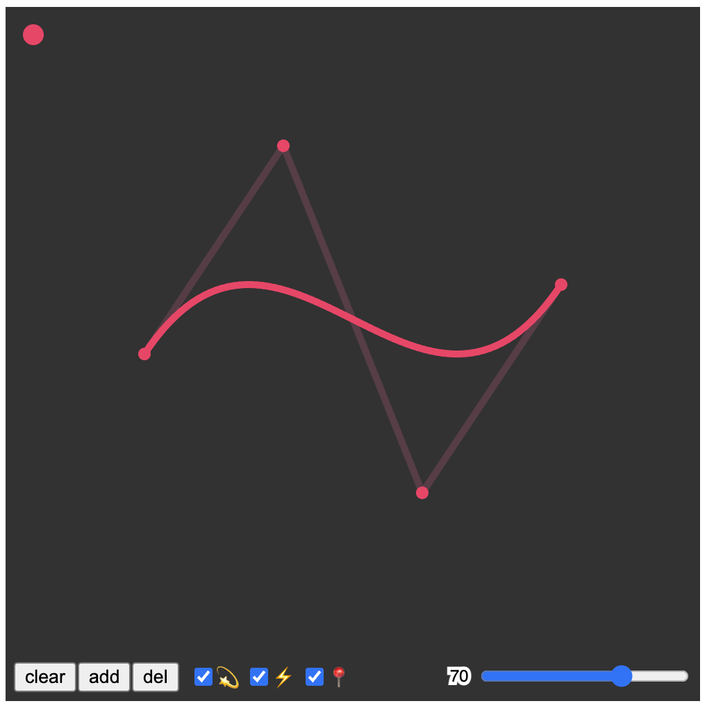

# bezier-P5

Projetinho de curva de Bezier utilizando [P5.js](https://p5js.org/).

Feito para a disciplina de Processamento Gráfico do CIn-UFPE.

[Online Demo](https://jrobertojunior.github.io/bezier-p5/)